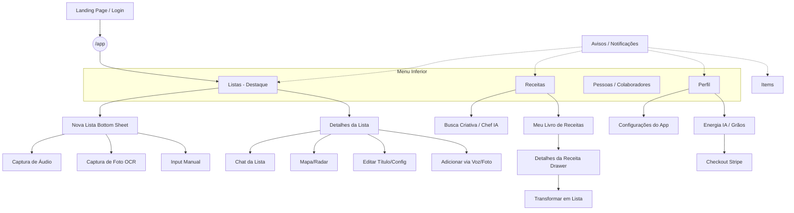

# Fluxograma de Navegação: Lista Pronta 🗺️

Este diagrama representa a arquitetura de informação e os fluxos de navegação propostos para o aplicativo, seguindo as diretrizes de "Native Feeling" e a organização solicitada.

## Próximos Passos de Revisão:

1.  **[ ] Tela de Listas:** Organização do Box, Cards e Drawer de Nova Lista.
2.  **[ ] Tela de Pessoas:** Gerenciamento de convites e amigos.
3.  **[ ] Tela de Perfil & Configurações:** Separação das áreas.
